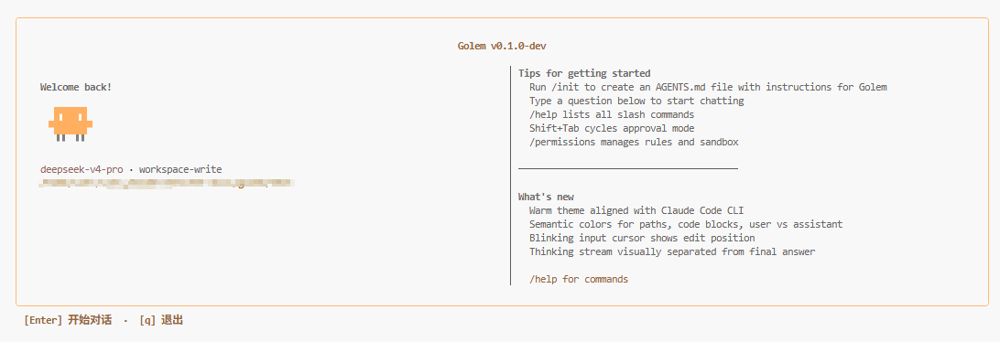
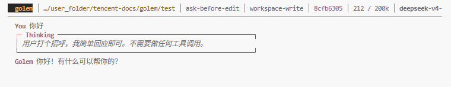
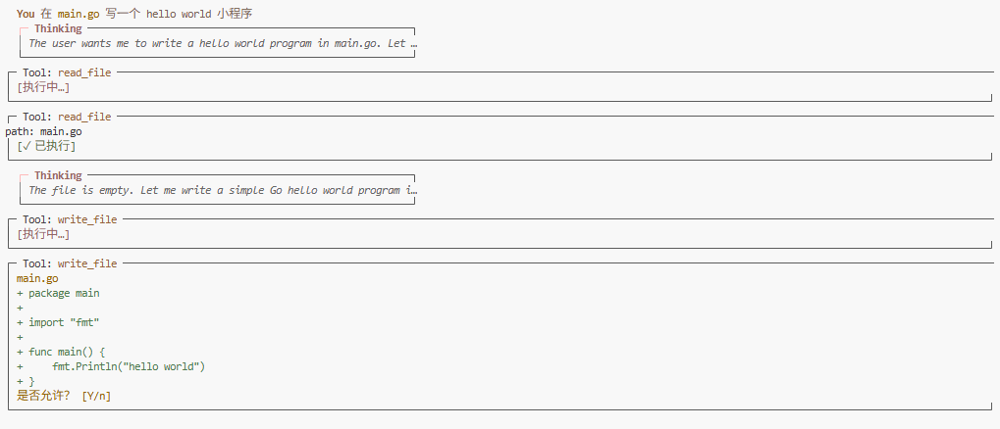

<div align="center">

# golem

**Go LLM Execution Model** — Go 原生的 AI 编程 Agent CLI

单二进制 · 零 CGO · 毫秒级冷启动 · 分层记忆 · 声明式权限 · 审批交互

[](https://github.com/liu-ethan/golem/actions/workflows/ci.yml)
[](https://github.com/liu-ethan/golem/actions/workflows/release.yml)
[](https://goreportcard.com/report/github.com/liu-ethan/golem)

**[项目主页](https://liu-ethan.github.io/golem/)** ·
**[GitHub](https://github.com/liu-ethan/golem)** ·
**[Releases](https://github.com/liu-ethan/golem/releases)**

</div>

<p align="center">
  
</p>

> 研究 Claude Code 与 Codex CLI 的核心架构差异，在 Go 生态中实现具备**分层记忆管道**、**声明式权限引擎**和**审批交互模式**的下一代 AI 编程助手。
>
> 完整图文介绍见 **[项目主页](https://liu-ethan.github.io/golem/)**。

---

## 目录

- [核心功能](#核心功能)
- [设计亮点](#设计亮点)
- [快速开始](#快速开始)
- [界面预览](#界面预览)
- [系统架构](#系统架构)
- [配置说明](#配置说明)
- [命令参考](#命令参考)
- [项目结构](#项目结构)
- [技术栈](#技术栈)
- [开发与测试](#开发与测试)
- [路线图](#路线图)
- [设计参考](#设计参考)

---

## 核心功能

从 Agent 主循环到三层记忆，golem 把 AI 编程助手需要的每一块都编译进一个静态二进制。

| | 模块 | 说明 |
|:---:|:---|:---|
| ⟳ | **Agent 主循环** | Streaming SSE 流式响应，自动识别 `tool_use` 并循环执行。内置 `bash`、`read_file`、`write_file`、`edit_file`、`list_dir`、`grep` 等工具 |
| ◎ | **三层记忆系统** | Layer 0 滑动窗口压缩、Layer 1 BM25 情节记忆、Layer 2 自动合并 `user_profile.md`。按需注入，降低 Token 消耗 |
| ⛨ | **四层安全模型** | 审批模式（UX）+ YAML 规则（bash 策略）+ `project_root` 路径隔离 + Linux Namespace 沙箱，各司其职 |
| ⌘ | **斜杠命令体系** | `/permissions`、`/sessions`、`/compact`、`/context` 等对齐 Claude Code / Codex CLI，`Shift+Tab` 切换审批模式 |
| ⚡ | **模型无关接入** | 统一 Anthropic Messages API 协议，`base_url` 可配 Claude、DeepSeek 等兼容端点 |
| ▣ | **Go 原生工程化** | 纯 Go SQLite（`modernc.org/sqlite`）、Bubble Tea TUI、GitHub Actions CI/CD，适合嵌入本地开发与自动化流水线 |

---

## 设计亮点

深入研究 Claude Code 与 Codex CLI 的架构差异，在 Go 生态中实现差异化增强。

### 能力对比

| 能力 | Claude Code / Codex | golem |
|------|---------------------|-------|
| 记忆检索 | 全量注入或固定上限 | **BM25 按需检索 top-K** |
| 记忆分层 | 单层或两阶段管道 | **三层架构** Working / Episodic / Semantic |
| 用户画像 | 有限或无 | 每项目 `user_profile.md`，每 3 次会话自动更新 |
| 上下文压缩 | 手动或自动触发 | **80% 阈值自动压缩** + `/compact` + `/context` 可视化 |
| 审批交互 | plan / ask / auto 等模式 | **四种模式** + `Shift+Tab` + `/permissions` 权限页 |
| 权限规则 | YAML 声明式规则 | 同样 YAML，`deny > ask > allow`，`/permissions` 管理 |
| 进程隔离 | 应用层 + sandbox 模式 | `project_root` 路径隔离 + bash namespace |
| 部署形态 | Node / Rust 运行时依赖 | **单静态二进制**，冷启动 < 20ms，零 CGO |
| 模型接入 | 厂商绑定或有限切换 | Anthropic 风格接口，`base_url` 自由配置 |

### 核心差异化

- **会记住你的 Agent** — 跨会话提取偏好与项目事实，BM25 检索按需注入，相比全量注入显著降低 Token 消耗
- **安全可控的执行环境** — 审批模式、YAML 规则、`project_root` 路径限制、bash namespace 四层分离，不把所有安全逻辑堆在一层
- **熟悉的 TUI 体验** — 暖色主题对齐 Claude Code CLI，Thinking 流与最终回答视觉分离，语义着色区分路径、代码块与消息
- **Go 生态原生** — 纯 Go SQLite 驱动、Bubble Tea 组件化 TUI、colocated 单元测试 + integration 端到端测试

---

## 快速开始

### 环境要求

| 项目 | 要求 |
|------|------|
| 语言 | Go 1.22+（源码构建） |
| 平台 | Linux / macOS / Windows；Namespace 沙箱仅 Linux |
| LLM | 任意兼容 Anthropic Messages API 的端点 |

### 方式一：下载 Release 二进制（推荐）

在 [Releases](https://github.com/liu-ethan/golem/releases) 页面下载对应平台包：

| 平台 | 文件名 |
|------|--------|
| Linux x86_64 | `golem-linux-amd64` |
| Windows x86_64 | `golem-windows-amd64.exe` |
| macOS Intel | `golem-darwin-amd64` |
| macOS Apple Silicon | `golem-darwin-arm64` |

```bash
# 示例：Linux
curl -LO https://github.com/liu-ethan/golem/releases/latest/download/golem-linux-amd64
chmod +x golem-linux-amd64
sudo mv golem-linux-amd64 /usr/local/bin/golem
```

每个 Release 附带 `SHA256SUMS`，可用 `sha256sum -c SHA256SUMS` 校验完整性。

### 方式二：源码构建

```bash
git clone https://github.com/liu-ethan/golem.git
cd golem
go build -o golem ./cmd/golem
```

多平台交叉编译（本地 Linux 即可）：

```bash
./scripts/build-release.sh v0.1.0 dist
```

### 配置并启动

在项目根目录创建 `.golem/config.yaml`（字段级 merge：`~/.golem/config.yaml` 为 base，项目配置覆盖同名字段）：

```yaml
provider:
  base_url: "https://api.anthropic.com"          # DeepSeek: https://api.deepseek.com/anthropic
  api_key: "${ANTHROPIC_API_KEY}"
  model: "claude-sonnet-4-5"
  context_limit: 200000

defaults:
  approval: ask-before-edit    # plan | ask-before-edit | ask | edit-automatically
  sandbox: workspace-write     # workspace-write | danger-full-access

memory:
  layer2_session_threshold: 3
  bm25_top_k: 5
  compact_batch_size: 10
  compact_threshold: 0.8
```

```bash
cd my-project          # 此处即为 project_root
golem                  # 启动 TUI
golem -version         # 查看版本
golem --approval plan  # 只读探索模式
```

---

## 界面预览

Bubble Tea 驱动的 TUI，流式渲染、工具调用卡片、审批确认——一切在终端内完成。

### 欢迎页

首次启动显示模型、sandbox 模式、常用斜杠命令提示。`Enter` 开始对话，`q` 退出。运行 `/init` 可生成 `AGENTS.md` 模板。

<p align="center">
  
</p>

### 对话界面

状态栏显示 `project_root`、approval 模式、sandbox、session ID、Token 用量与模型名。Thinking 块与最终回答视觉分离，透明展示推理过程。

<p align="center">
  
</p>

### 工具执行

`read_file` 自动执行，`write_file` 在 `ask-before-edit` 模式下弹确认。Diff 预览 inline 展示，`Y`/`Enter` 批准，`n`/`Esc` 拒绝。

<p align="center">
  
</p>

> 更多截图与交互说明见 **[项目主页 · 如何使用](https://liu-ethan.github.io/golem/#usage)**。

---

## 系统架构

从用户输入到记忆提取的完整执行管道，安全层与审批层严格分离。

```
用户输入
  ↓
[会话管理层]
  ├── 读取历史会话（SQLite）
  ├── BM25 检索相关记忆片段（memory_facts 表）
  └── 注入 system prompt（user_profile.md + top-K 记忆）
  ↓
[Agent 主循环]
  ↓
  LLM API（Streaming SSE，goroutine + channel）
  ↓
  解析 tool_use 块
  ↓
[权限规则层]          ← 仅 bash；deny > ask > allow，先于审批层
  ├── deny 命中 → 直接拒绝，不弹框
  └── allow/ask 命中 → 进入审批层
  ↓
[审批交互层]          ← plan / ask-before-edit / ask / edit-automatically
  ↓
[沙箱 / 路径校验]      ← bash：namespace fork；文件工具：project_root 内
  ↓
  工具执行（循环直到无 tool_use）
  ↓
最终回答输出
  ↓
[记忆提取层]
  └── 会话结束同步提取 → SQLite；每 3 次会话触发 Layer 2 合并 → user_profile.md
```

### 记忆分层

```
Layer 0 · Working Memory
  当前会话 message history
  context 达 80% 自动压缩

Layer 1 · Episodic Memory
  会话结束提取 3–5 条事实
  BM25 检索 top-K 注入

Layer 2 · Semantic Memory
  每 3 次会话合并 → .golem/user_profile.md
  始终注入 system prompt
```

---

## 配置说明

### 配置优先级

1. `~/.golem/config.yaml` — 全局 base
2. `<project_root>/.golem/config.yaml` — 同名字段覆盖
3. CLI flags — 覆盖 `defaults` 字段

### 权限规则

合并加载 `.golem/rules.yaml` + `~/.golem/rules.yaml`（项目在前）。**仅匹配 `bash` 工具的 command 字符串**；文件工具靠 `project_root` 路径限制。

```yaml
# ~/.golem/rules.yaml
rules:
  - action: allow
    pattern: "go *"
  - action: allow
    pattern: "git *"
  - action: ask
    pattern: "curl *"
  - action: deny
    pattern: "rm -rf *"
  - action: deny
    pattern: "wget *"

priority: deny > ask > allow
```

### Sandbox 模式

| 模式 | 行为 |
|------|------|
| `workspace-write`（默认） | bash：namespace fork；文件工具限制在 `project_root` 内 |
| `danger-full-access` | bash 无 namespace；文件工具仍限制在 `project_root` |

**项目根目录**：你在哪个目录执行 `golem`，哪里就是 `project_root`（启动时冻结）。

---

## 命令参考

### CLI 入口

```bash
golem                                      # 启动 TUI，新建会话
golem --resume <session-id>                # 恢复历史（也可用 /sessions）
golem --approval ask-before-edit           # 指定审批模式
golem --sandbox workspace-write            # 指定沙箱模式
golem "帮我读一下 main.go 并总结"           # headless 模式
golem sessions list                        # CLI 列会话
golem sessions delete <id>                 # 删除会话
golem skill install github:user/repo/name  # 安装 Skill
```

### 常用斜杠命令

| 命令 | 说明 |
|------|------|
| `/permissions` | 权限页：切换 approval 模式 + 查看 rules |
| `/sessions` | 会话列表页，点选 resume |
| `/compact` | 手动触发 Layer 0 压缩 |
| `/context` | 可视化 context 占用 |
| `/diff` | 显示 working tree git diff |
| `/status` | 显示 model / approval / sandbox / session / tokens |
| `/model [name]` | 运行时切换 LLM 模型 |
| `/clear` | 清空上下文开新会话（保留 user_profile） |
| `/help` | 命令与快捷键 |
| `/exit` | 正常结束并退出 |

### 审批模式

| 模式 | 行为 | 适用场景 |
|------|------|----------|
| `plan` | 只读：read/list/grep 自动；write/edit/bash **直接拒绝** | 探索代码库、做方案 |
| `ask-before-edit` | 读操作自动，write/edit/bash 前确认 | **默认推荐** |
| `ask` | 任意 tool 执行前均弹确认 | 谨慎模式 |
| `edit-automatically` | 全部自动执行（rules.ask 仍确认） | 完全信任环境 |

### 快捷键

| 按键 | 作用 |
|------|------|
| `Shift+Tab` | 循环切换 approval 模式 |
| `Ctrl+C`（流式中） | 取消当前轮 |
| `Ctrl+C` / `Ctrl+D`（空闲） | 等同 `/exit` |
| `Ctrl+L` | 清屏 |
| `Y` / `Enter` | 批准工具执行 |
| `n` / `Esc` | 拒绝工具执行 |

---

## 项目结构

```
golem/
├── cmd/golem/              # CLI 入口
├── internal/
│   ├── llm/                # LLMClient 接口与 Streaming 实现 + prompts/
│   ├── agent/              # Agent 主循环与 tool_use 分发
│   ├── tools/              # 内置工具集
│   ├── approval/           # 审批交互模式
│   ├── rules/              # YAML 权限规则引擎
│   ├── sandbox/            # Linux Namespace 沙箱
│   ├── session/            # SQLite 会话持久化
│   ├── memory/             # 三层记忆系统 + BM25 检索
│   ├── skills/             # Skill 加载与安装
│   ├── testutil/           # 跨包共享测试辅助
│   ├── integration/        # 端到端集成测试
│   └── tui/                # Bubble Tea TUI
├── scripts/
│   └── build-release.sh    # 多平台交叉编译
├── assert/                 # README / 主页截图素材
├── .github/workflows/      # CI + Release
└── .golem/                 # 项目级配置（运行时）
    ├── config.yaml
    ├── rules.yaml
    ├── user_profile.md
    └── data/golem.db
```

---

## 技术栈

| 类别 | 技术 |
|------|------|
| 语言 | Go 1.22+ |
| LLM | Anthropic Messages API，`base_url` 可配 Claude / DeepSeek 等 |
| 数据库 | [modernc.org/sqlite](https://pkg.go.dev/modernc.org/sqlite)（纯 Go，无 CGO） |
| TUI | [Bubble Tea](https://github.com/charmbracelet/bubbletea) |
| 配置 | YAML（`gopkg.in/yaml.v3`） |
| 沙箱 | `golang.org/x/sys/unix`（Linux namespace） |
| CI/CD | GitHub Actions（`ci.yml` + `release.yml`） |

---

## 开发与测试

```bash
# 运行测试
go test ./...

# 静态检查
go vet ./...

# 构建
go build ./cmd/golem

# 本地打 Release 包
./scripts/build-release.sh v0.1.0-test dist
```

核心模块（记忆提取、BM25 检索、权限规则引擎、Agent tool_use 解析）均覆盖单元测试；`internal/integration/` 提供 agent round-trip、`--resume` 还原、Layer 2 触发等端到端测试。CI 在每次 push / PR 时自动运行。

### 发布新版本

```bash
git tag v0.1.0
git push origin v0.1.0
```

推送 tag 后，`release.yml` 自动交叉编译四平台二进制并创建 [GitHub Release](https://github.com/liu-ethan/golem/releases)。

---

## 路线图

| 优先级 | 模块 | 状态 |
|--------|------|------|
| P0 | Agent 主循环、工具集、四种 approval、`/permissions` `/sessions` `/help` `/exit`、Session、配置 | 进行中 |
| P1 | 三层记忆（BM25）、权限规则引擎、Namespace 沙箱、CI Pipeline、`/status` `/model` `/compact` `/context` `/diff` | 计划中 |
| P2 | headless、`/review` `/memories` `/usage` `/skills` `/init`、Skills install、web_search | 计划中 |
| P3 | `/rewind` `/doctor`、Embedding 向量检索、Web UI | 待定 |
| P4 | MCP Servers | 不做 |

---

## 设计参考

golem 在架构设计上深入研究了以下开源项目：

| 项目 | 语言 | 借鉴点 |
|------|------|--------|
| [openai/codex](https://github.com/openai/codex) | Rust | 审批模式、两阶段记忆管道、权限规则引擎 |
| [AlleyBo55/gocode](https://github.com/AlleyBo55/gocode) | Go | Skills 系统、多 Agent、Model Fallback |
| [ProjectBarks/gopher-code](https://github.com/ProjectBarks/gopher-code) | Go | 极简 Go 实现，毫秒级冷启动 |
| [Kuberwastaken/claurst](https://github.com/Kuberwastaken/claurst) | Rust | ACP 协议支持 |

---

<div align="center">

**[项目主页](https://liu-ethan.github.io/golem/)** · **[GitHub](https://github.com/liu-ethan/golem)** · **[Releases](https://github.com/liu-ethan/golem/releases)**

*golem — Go LLM Execution Model*

</div>
